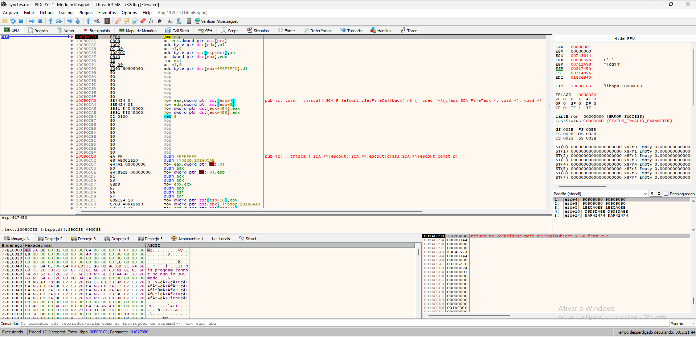
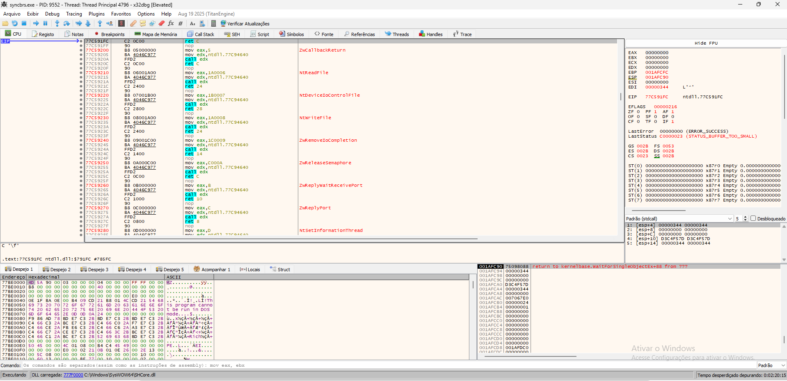
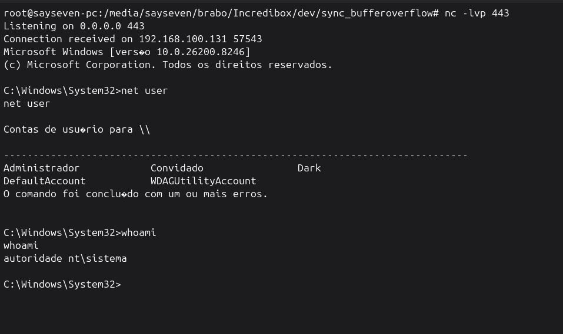

# SyncBreeze BOF Lab

Professional educational laboratory focused on **stack-based buffer overflow exploitation** against **SyncBreeze Enterprise** in a controlled environment.

This repository documents the practical exploit development workflow from vulnerability trigger to shellcode execution, using reproducible scripts and validation steps.

---

## Objective

This project was built to study and document:

- offset discovery  
- EIP overwrite control  
- bad character identification  
- JMP ESP redirection  
- NOP sled usage  
- shellcode injection  
- reverse shell execution  
- payload consistency validation  

---

## Repository Structure

```text
syncbreeze-bof-lab/
├── syn_xpl.py
├── syn_xpl_bk.py
├── bad.py
├── test_syn_xpl.py
├── screenshots/
├── README.md
└── LICENSE
```

---

## Technical Overview

The exploit uses:

- **Target:** SyncBreeze Enterprise  
- **Architecture:** x86  
- **Exploit Type:** Stack Buffer Overflow  
- **Offset:** 780 bytes  
- **Return Address:** JMP ESP inside loaded module  
- **Payload:** Reverse shell shellcode  

---

## Payload Layout

```text
[padding][EIP overwrite][NOP sled][shellcode]
```

Example:

```python
payload = b"A" * OFFSET + RET + b"\x90" * 16 + shellcode
```

---

## Exploitation Workflow

### 1. EIP Control Validation

The payload successfully reaches instruction pointer control.



---

### 2. Payload Execution Inside Debugger

Shellcode positioned in memory after successful redirection.



---

### 3. Reverse Shell Confirmation

Successful shell execution with elevated privileges.



---

## Included Components

### Exploit Script

Main exploit delivery:

```bash
python3 syn_xpl.py
```

### Bad Character Generator

Used during badchar validation:

```bash
python3 bad.py
```

### Regression Tests

Payload validation:

```bash
python3 test_syn_xpl.py
```

---

## Laboratory Notes

- Developed strictly for educational use  
- Intended for local lab environments  
- No production targets  
- Controlled exploit development practice  

---

## Future Improvements

- Egghunter variation  
- SEH version  
- Modular shellcode loader  
- Automated offset finder  

---

## Author

**Lucas Morais (SaySeven / @sayseven7)**

Compatibility-focused offensive security study repository.
